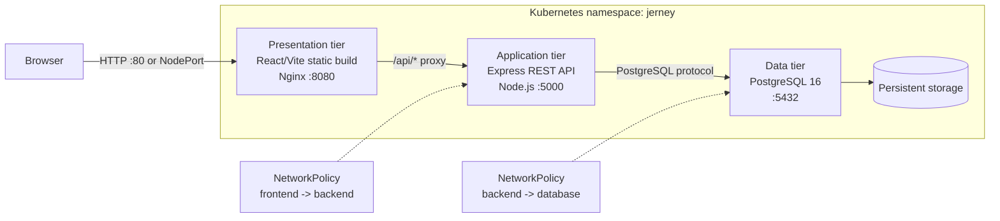
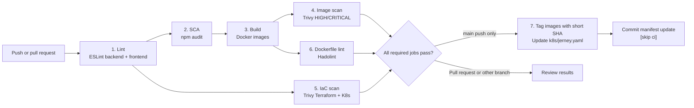

# Jerney - DevSecOps Three-Tier Blog Platform

Jerney is a React blog platform delivered as a three-tier application:

1. **Presentation tier:** React and Vite, served by Nginx.
2. **Application tier:** Node.js and Express REST API.
3. **Data tier:** PostgreSQL 16 for posts and comments.

The repository also demonstrates containerization, infrastructure as code, Kubernetes deployment on Amazon EKS Auto Mode, and a GitHub Actions security pipeline.


## Features

- Create, edit, and delete blog posts.
- Add and delete comments.
- React single-page interface with client-side routing.
- Health endpoint for container and Kubernetes probes.
- Nginx security headers and dot-file blocking.

## Three-tier architecture



### Request flow

1. A browser requests the Nginx frontend. Nginx serves the compiled React assets and applies `X-Frame-Options`, `X-Content-Type-Options`, `Referrer-Policy`, and related headers.
2. React sends API calls to `/api/...`. Nginx proxies those calls to the Express service; the browser does not connect directly to PostgreSQL.
3. Express mounts the posts and comments routes, validates and processes the request, and uses the `pg` connection pool to query PostgreSQL.
4. PostgreSQL stores posts and comments. Comments reference posts with `ON DELETE CASCADE`, so deleting a post also removes its comments.
5. `/api/health` is used by Kubernetes liveness and readiness probes to decide whether API pods can receive traffic.

### How the tiers are isolated

| Tier | Local Docker Compose | Kubernetes on EKS | Exposure |
|---|---|---|---|
| Presentation | `jerney-frontend`, Nginx | 2 frontend pods, NodePort service | Public entry point |
| Application | `jerney-backend`, Express | 2 backend pods, ClusterIP service | Internal only |
| Data | `jerney-db`, PostgreSQL volume | 1 PostgreSQL pod, encrypted EBS PVC, ClusterIP service | Internal only |

Kubernetes network policies allow traffic to the backend only from frontend pods and traffic to PostgreSQL only from backend pods. Backend and frontend containers run as non-root users, drop Linux capabilities, and disable privilege escalation. The backend uses a read-only root filesystem and receives database values from a Kubernetes Secret.

## DevSecOps pipeline



The workflow is defined in [`.github/workflows/ci-cd.yml`](.github/workflows/ci-cd.yml):

| Stage | What it does | Current behavior |
|---|---|---|
| Lint | Installs Node.js 20 dependencies and runs ESLint for both tiers | Required by later jobs |
| Dependency audit | Runs `npm audit --audit-level=high` | Reports findings but currently uses `|| true` |
| Build | Builds backend and frontend images with Buildx | Pushes to GHCR except on pull requests; adds provenance and SBOM metadata |
| Image scan | Scans both images with Trivy for OS and library vulnerabilities | Reports HIGH and CRITICAL findings; `exit-code: 0` currently keeps the job non-blocking |
| IaC scan | Scans `terraform/` and `k8s/` with Trivy | Reports configuration findings; currently non-blocking |
| Dockerfile lint | Runs Hadolint against both Dockerfiles | Fails at the `error` threshold |
| Manifest update | Replaces image references with the short commit SHA | Runs only after a successful push to `main`, then commits the manifest |

The workflow prepares and versions deployment artifacts; it does not run `terraform apply` or `kubectl apply`. A separate deployment step or GitOps controller is required to apply the updated manifest to EKS.

## Infrastructure and deployment

### AWS infrastructure with Terraform

Terraform provisions:

- A VPC spanning three availability zones.
- Public and private subnets with a NAT gateway.
- An Amazon EKS Auto Mode cluster using the private subnets.
- Kubernetes API endpoint access, cluster audit logging, and envelope encryption for Kubernetes Secrets.

```bash
cd terraform
terraform init
terraform plan
terraform apply

aws eks update-kubeconfig --region us-east-1 --name jerney-eks
```

Review `terraform.tfvars` and use a remote state backend plus a secrets manager for production. The checked-in demo values and Kubernetes Secret are suitable only for local or learning environments.

### Deploy the three tiers to EKS

```bash
kubectl apply -f k8s/jerney.yaml
kubectl get pods,svc -n jerney
kubectl get networkpolicy -n jerney

# The frontend service is a NodePort in this configuration.
kubectl port-forward svc/jerney-frontend 8080:80 -n jerney
```

Open `http://localhost:8080`. The frontend service is intentionally a `NodePort` because this manifest does not create an AWS load balancer. The backend and database services remain `ClusterIP` services.

### Run locally with Docker Compose

```bash
docker compose up --build
```

Open `http://localhost`. Compose creates a PostgreSQL volume, waits for the database health check before starting the backend, and exposes only the frontend on the host. The frontend Nginx container proxies `/api/` to the backend service.

Stop the stack with:

```bash
docker compose down
```

Add `-v` only when you intentionally want to delete the local PostgreSQL data volume.

### Deploy to a single EC2 host

The [EC2 setup script](deploy/setup.sh) installs Node.js 20, PostgreSQL, Nginx, and PM2. It builds the React application, configures Nginx to serve the presentation tier and reverse proxy `/api/` to port 5000, then keeps the Express process running with PM2.

```bash
scp -r -i your-key.pem . ubuntu@<EC2_PUBLIC_IP>:~/Jerney
ssh -i your-key.pem ubuntu@<EC2_PUBLIC_IP>
cd ~/Jerney
chmod +x deploy/setup.sh
./deploy/setup.sh
```

This is a single-host deployment of the same three logical tiers. For production, replace the demo database password with a secret, restrict the security group to the required ports, and use TLS at the edge.

## Local development without Docker

Prerequisites: Node.js 20+ and PostgreSQL 16+.

```bash
cd backend
npm ci
set DB_HOST=localhost
set DB_PORT=5432
set DB_USER=jerney_user
set DB_PASSWORD=jerney_pass_2026
set DB_NAME=jerney_db
set PORT=5000
npm start
```

In a second terminal:

```bash
cd frontend
npm ci
npm run dev
```

The Vite development server listens on `http://localhost:3000` and proxies `/api` to `http://localhost:5000`.

## API endpoints

| Method | Endpoint | Description |
|---|---|---|
| GET | `/api/health` | Health check |
| GET | `/api/posts` | Get all posts |
| GET | `/api/posts/:id` | Get one post with comments |
| POST | `/api/posts` | Create a post |
| PUT | `/api/posts/:id` | Update a post |
| DELETE | `/api/posts/:id` | Delete a post |
| GET | `/api/comments/post/:postId` | Get comments for a post |
| POST | `/api/comments` | Create a comment |
| DELETE | `/api/comments/:id` | Delete a comment |

## Project structure

```text
.
├── frontend/                 # React/Vite presentation tier and Nginx image
├── backend/                  # Express application tier and PostgreSQL access
├── docker-compose.yml        # Local three-container deployment
├── k8s/jerney.yaml           # Namespace, workloads, services, storage, policies
├── terraform/                # AWS VPC and EKS Auto Mode infrastructure
├── deploy/                   # Single-host EC2 installation
└── .github/workflows/        # CI/CD and security checks
```

## Security notes

- Container images use multi-stage builds and non-root runtime users.
- Kubernetes workloads define resource requests and limits, probes, restricted capabilities, and disabled service-account token automounting.
- PostgreSQL storage uses an encrypted gp3 EBS StorageClass with a retained PVC.
- Replace all demo credentials before sharing or deploying this project outside a sandbox.
- The current audit and image scan jobs are visibility gates rather than hard vulnerability gates because their workflow steps use `exit-code: 0`; tighten those settings before treating CI as a release approval.

## License and author

This project is a personal DevSecOps learning project by **Shreyash Londhe**.
